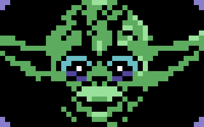
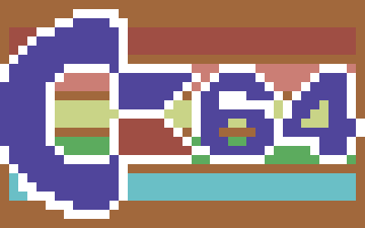

[](https://github.com/demyanovs/c64img/actions) [](https://pkg.go.dev/github.com/demyanovs/c64img)
# c64img

c64img is a generator of a BASIC program for Commodore 64 that draws a simple image on the screen using colored characters from a provided static image.

## Details

### How commodore 64 screen works

The Commodore 64 screen consists of 25 rows of 40 characters each.

The first character of the screen (top left) starts at address 1024, and each next character is represented by 1024 + 1 address.

### How c64img generator works

c64img reads provided image, converts colors to the Commodore 64 predefined palette, and for each pixel adds corresponding color code to the array.

The array of color codes is then written to the file as a BASIC program using the DATA and POKE commands to set the value to a memory address.

## Requirements

- **Format**: JPEG, PNG, or GIF
- **Resolution**: Must be exactly 40×25 pixels
- **Colors**: Any number (automatically converted to C64's 16-color palette)

## Installation

### From Binary

You can use pre-built binary for your OS from the release.

### From Source

To install from the source code, you need to have Go installed on your machine. If you don't have Go installed, you can download it from the [official website](https://go.dev/dl/).

#### Option 1: Go Install (recommended)
```bash
go install github.com/demyanovs/c64img@latest
```

#### Option 2: Build from source
```bash
git clone https://github.com/demyanovs/c64img.git
cd c64img
go build -o c64img
```

## Usage
```bash
./c64img -i input.png -f output.basic -o output.png -dither
```

### Example
```bash
# Convert an image with dithering
./c64img -i example/input_01.png -f yoda.basic -o yoda_preview.png -dither

# Simple conversion without dithering
./c64img -i example/input_02.png -f c64logo.basic
```

### Command-Line Options
- `-i` **(required)**: path to the input image.
- `-f`: path to the file where the generated BASIC program will be stored.
- `-o`: path to the output image converted to Commodore 64 palette.
- `-dither`: uses the Floyd–Steinberg dithering algorithm to convert the image. Default is `false`.

You can always run for help:
```bash
./c64img -help
```

## Screenshots
<p align="center">
    
    
</p>

## Example images

Example 40x25 input pixel images can be found here:

- [input_01.png](example/input_01.png)<br/>
- [input_02.png](example/input_02.png)

## Tests

### Run all tests
```bash
go test -v
```

### Coverage
```bash
go test -cover
go test -coverprofile=coverage.out
go tool cover -html=coverage.out
```

### Benchmarks
```bash
go test -bench=. -benchmem
```

## Credits
This generator was inspired by [64bites](https://64bites.com/blog/2015/05/31/create-a-1k-image-for-c64-with-ruby/) video series.

## Contributing

Pull requests are welcome. For major changes, please open an issue first to discuss what you would like to change.

Please make sure to update tests as appropriate.

## License

[MIT](https://choosealicense.com/licenses/mit/)